# GNBFrontend

GNBFrontend 是 [GNB](https://github.com/gnbdev/gnb "GNB") VPN 的开源图形界面前端。

[GNB](https://github.com/gnbdev/gnb "GNB")是一个开源的去中心化的具有内网穿透能力通过P2P进行三层网络交换的VPN。

GNB可以让用户把异地的办公环境以及家庭环境组成一个虚拟的局域网，这个虚拟的局域网中的机器不需要公网IP，不需要公网服务器中转就可以实现TCP/IP通讯。

与大多数内网穿透的软件实现应用层协议代理不同，GNB是通过虚拟网卡实现IP分组转发，支持应用层所有基于TCP/IP的通信协议。

GNB的配置文件十分简单非常容易在各平台部署运行起来，但毕竟涉及到非对加密的密钥创建和公钥交换，因此一些操作是必不可少的，通过 GNBFrontend 这个GUI
可以简化创建密钥、分发公钥、批量生成GNB节点配置；用户可以在GUI上启动/停止GNB的节点简化了命令行操作的过程。

要注意的是通过GNBFrontend创建一组GNB节点事实上是集中生成了一批公私钥然按照每个节点一对公私钥分配，每个节点都持有其他节点的公钥；这种集中生成分发密钥方式并不适合对安全要求极高的场景，有对安全要求更高的用户可以通过查阅相关文档进行定制化的配置部署GNB节点。

以下是Windows平台上使用GNBFrontend创建、分发、启动GNB节点的过程。

## 创建并导出GNB节点

### Step1

从 Github 上下载的[release](https://github.com/XyloseYuthy/GNBFrontend/releases)文件解压后的目录文件，点击文件 GNB_NODE_SETUP.exe 运行

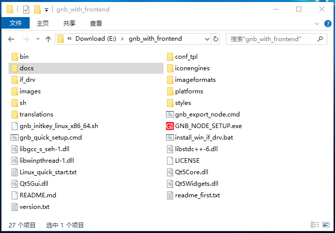

### Step2

点击“create gnb node”

在弹的输入框中输入要创建的GNB节点的数量。
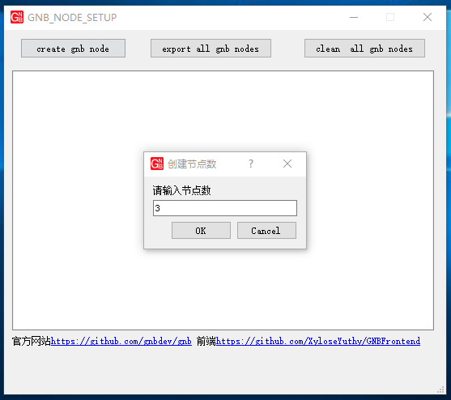

受模板的限制，目前最多可以生成6个节点，在将来版本可以支持更多，当前如果需要配置更多节点就需要根据文档去配置。

完成节点创建后，会发现目录里多出一个 conf 目录，这是依据 conf_tpl 为模板创建的，与此同时通信的密钥也创建好并放在对应的目录里。

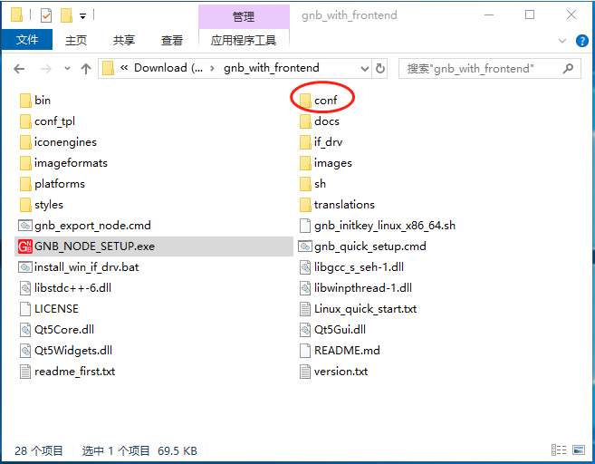

完成上面的步骤后会看到创建好的节点会出现在列表中。

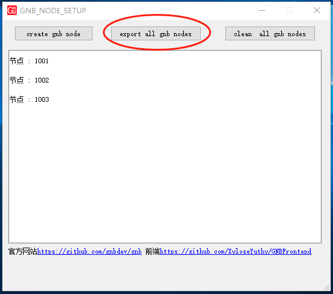

### Step3
点击 "export all gnb nodes" 导出创建的节点，导出的GNB节点包括完整的各平台的gnb可执行二进制文件、配置文件、脚本及通讯密钥，这些数据都将被整齐放置在正确的目录里。

在弹出的文件选择框里选择一个目录作为导出节点的目录

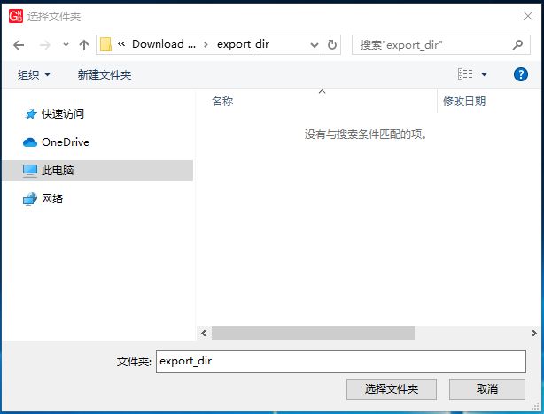

此时 GNB_NODE_SETUP 会弹一个控制台窗口执行节点导出的工作并在执行完毕后自行关闭。

当前版本只可导出所有创建好的节点。

完成节点导出后，GNB_NODE_SETUP 会在文件管理器中打开导出的目录，可以看到每个GNB节点被放在不同的目录里。
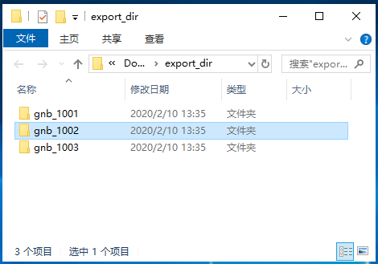

## 分发GNB节点

把导出的节点拷贝到要启动的GNB节点的机器上，这些机器可以 Linux X86_64、树莓派Linux、Windows、macOS、FreeBSD、OpenBSD、运行 OpenWRT 的路由器。

用户也可以把这些节点打成压缩包发给其他你可信的人去使用，要注意的是当两台计算机分别启动了两个GNB后，这两台处于不同地方的计算机将穿透各自的内网建立一条虚拟的链路，有各自的虚拟ip，就像在同一个局域网中可以进行自由通讯，因此需要关注网络安全。

## 启动GNB节点

### Step1
进入目录 gnb_1002 点击运行 GNB_FRONTEND.exe

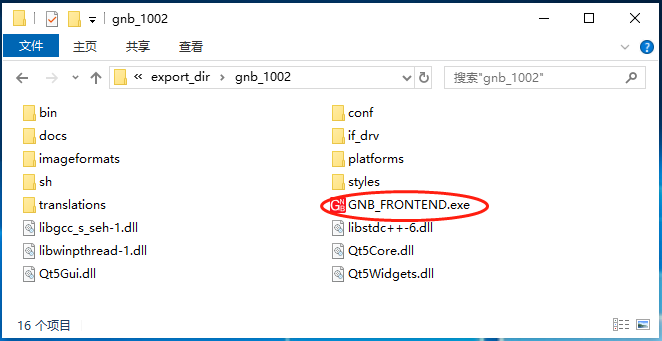

可以看到 1002 节点出现在列表中

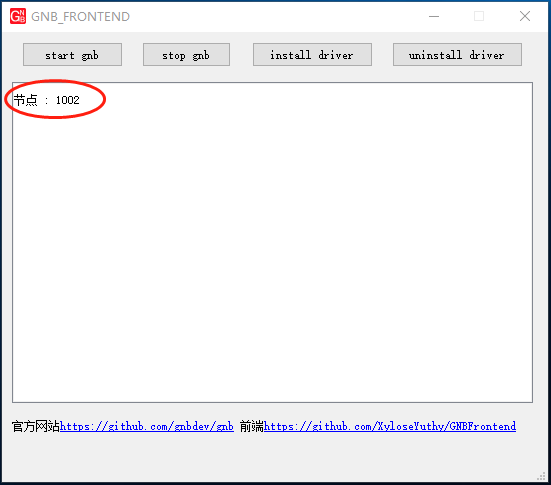

### Step2

如果这个Windows系统之前从没运行过GNB，这时可能需要先安装一个来自OpenVPN开发的虚拟网卡驱动，点击“install driver”  安装。

安装驱动前会让用户确认是否要安装。

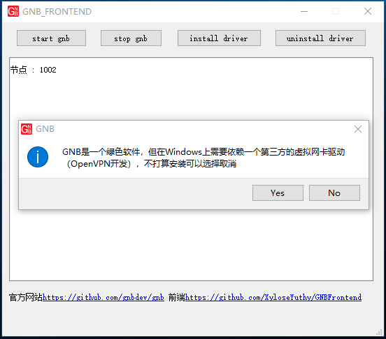

安装好驱动后会在控制面板的网络连接中看到多出一个网卡，这是虚拟网卡，状态是断开的，不需要对其进行任何设置。

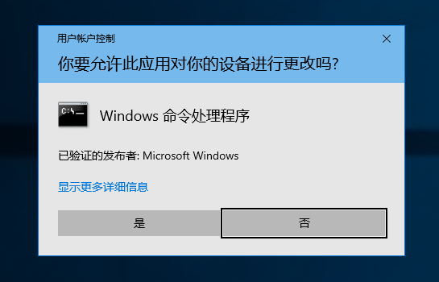

要注意的是，如果系统中还安装有其他VPN软件，并且也是使用OpenVP提供的虚拟网卡就需要注意不要发生冲突，如果运行发生异常，可以先停止其他VPN软件再运行GNB，又或者先停止GNB再运行其他VPN软件。

事实上，只要规划好，包括ip和路由这些技术细节，GNB和其他VPN可以同时启动。

### Step3

在安装好虚拟网卡后就可以点击 “start gnb”

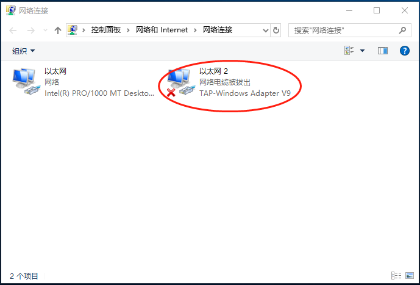

由于 gnb 需要管理员权限访问虚拟网卡，因此这里弹出“用户账户控制” 窗口询问用户是否同意，如果确定要启动GNB就请点击“是”。
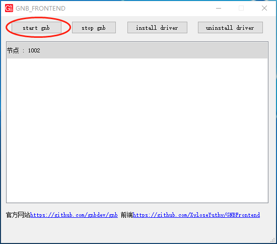

还有允许防火墙权限，如果确定要启动GNB就请点击“允许访问”；要注意的是如果此时点击“”取消”，系统可能就会记住用户这个选择，下次启动GNB也不会出现这个提示，这时需要到“”控制面板” “Windows Defender 防火墙” 去解除这个限制，这个过程比较麻烦。

GNB节点运行过程中会打开两个控制台窗口，可以从中看到一些GNB运行的日志。

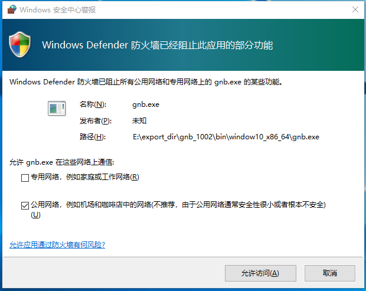

如果要停止GNB最要不要直接关闭这两个窗口，可以通过点击 “stop gnb” 停止 GNB。

### Step4
检查服务
这时在控制面板的网络连接里可以看到这个虚拟网卡的状态是接通，但是提示“未识别的网络”，这没关系，属于正常情况。

通过 ipconfig 命令可以看到 虚拟网卡已经成功设置了虚拟ip 10.1.0.2

### Step5
把 gnb_1003 拷贝到另外一台机器上，重复上述的步骤启动节点 1003 ，1003 的虚拟ip地址被配置成 10.1.0.3。

### Step6
测试网络
在 虚拟ip为 10.1.0.2 的主机上 ping 10.1.0.3 确认对端虚拟的ip是否是通的。

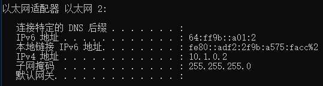

要注意的是，默认情况下Windows系统的防火墙会关闭icmp，因此两台Windows主机之间ping是被系统防火墙拦截的，这时可以尝试其他网络服务例如“网络文件共享”去确认两台机器已经连通。

此时，两台主机即使是处于异地的两个局域网通过nat方式上网，即使出口没有公网ip4，也不需要公网中转服务就可以在一个虚拟局域网里进行tcp/ip通讯了。

GNB极致的nat穿透能力使得在内网环境的GNB节点在大部分网络环境下不需要公网服务器中转数据进行虚拟组网，但两台异地的主机需要位于公网的index节点找到对方这类似于BT的Tracker或DNS，index节点可以有多个，由志愿者提供，具体细节在配置文件address.conf中。

